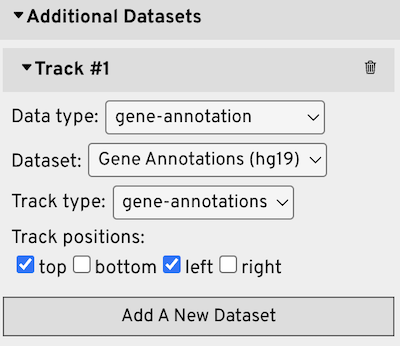
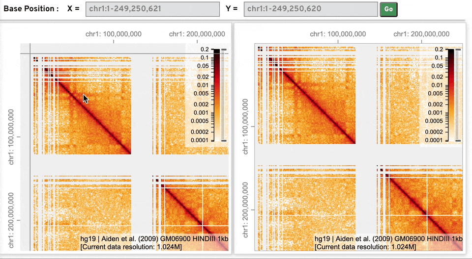
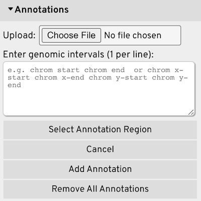

# HiCube

HiCube is a web application provides interactive visualization of multiscale and multimodal Hi-C and 3D genome data. 

HiCube provides following unique features and functionality:

- Paired case synchronization
- Zoom view at higher resolution
- Add configurable annotations


See [docs/README.md](/docs/README.md) for how to recreate the above figure.

[Demo site](https://hicube-86906.web.app/)

## Table of contents

- [1 Installation](#1-installation)
	- [1.1 From pre-built](#11-from-pre-built)
		- [1.1.1 Option 1: Node.js](#111-option-1-nodejs)
		- [1.1.2 Option 2: Python](#112-option-2-python)
	- [1.2 From source code](#12-from-source-code)
- [2 Usage](#2-usage)
	- [2.1 Prepare input datasets and API server](#21-prepare-input-datasets-and-api-server)
		- [2.1.1 Hi-C and 1D datasets](#211-hi-c-and-1d-datasets)
		- [2.1.2 3D genome structure datasets](#212-3d-genome-structure-datasets)
	- [2.2 Visualize datasets in HiCube](#22-visualize-datasets-in-hicube)
		- [2.2.1 Add datasets to create a case](#221-add-datasets-to-create-a-case)
		- [2.2.2 Create a paired case](#222-create-a-paired-case)
		- [2.2.3 Navigation](#223-navigation)
		- [2.2.4 Add zoom view](#224-add-zoom-view)
		- [2.2.5 Add annotations](#225-add-annotations)
	- [2.3 Configurate the appearance](#23-configurate-the-appearance)
		- [2.3.1 Panel sizes](#231-panel-sizes)
		- [2.3.2 3D genome structure tracks](#232-3d-genome-structure-tracks)

## 1 Installation

### 1.1 From pre-built

Download the [build version](https://drive.google.com/file/d/1Z-k3tGMK0_rlbONuqD-OUT6Wybnhq__g/view?usp=sharing), unzip it, then use a static site server, for example, you can choose `serve` from Node.js or `http.server` from python, to run HiCube:

#### 1.1.1 Option 1: Node.js

First install [Node.js](https://nodejs.org/download/release/v16.15.0/) v16.15.0 version, then install `serve`: 

```bash
# install a static site server
npm install -g serve
# on macOS may need to use sudo to install globally
sudo npm install -g serve
```

Finally, start the server inside the `HiCube` directory:

```bash
# change the current directory to HiCube
cd HiCube
# start the server
serve -s
```

then go to the URL it prints out.

#### 1.1.2 Option 2: Python

If you have `python3` installed, it also provides a static site server:

```bash
# change the current directory to HiCube
cd HiCube
# start the server
python -m http.server
```

then go to http://localhost:8000

### 1.2 From source code

If you want to run HiCube from its source code, first clone the repository to your computer:

```bash
git clone https://github.com/wmalab/HiCube.git
```

Install [Node.js](https://nodejs.org/download/release/v16.15.0/) v16.15.0 version.

In the project directory, first run `npm install` to install all the dependencies, then `npm start` to start the app.

```bash
cd HiCube
npm install
npm start
```

Open [http://localhost:3000](http://localhost:3000) to use HiCube in your browser.

## 2 Usage
### 2.1 Prepare input datasets and API server

All example datasets can be downloaded at [shared drive folder](https://drive.google.com/drive/folders/12_kfP9tELVEPKOw7ODgx8x2MVYUvi59T?usp=sharing).

#### 2.1.1 Hi-C and 1D datasets

The Hi-C and other 1D datasets need to be served with [HiGlass Server](https://github.com/higlass/higlass-server) for access. There are two public availalbe HiGlass API servers: http://higlass.io/api/v1 and https://higlass.4dnucleome.org/api/v1 that can be used to access vast amount of public datasets. 

To serve local datasets, the easiest way is to setup a local HiGlass API server with [Docker](https://www.docker.com/) using the [higlass-docker](https://github.com/higlass/higlass-docker) image, and the local API server can be accessed at http://localhost:8888/api/v1 for HiCube.

Create a directory (e.g. `~/hg-data`) to store the datasets, example files can be downloaded from [shared drive folder](https://drive.google.com/drive/folders/12_kfP9tELVEPKOw7ODgx8x2MVYUvi59T?usp=sharing).

```bash
# Pull the latest image of higlass-docker
docker pull higlass/higlass-docker

# Start docker container
docker run --detach \
	--publish 8888:80 \
	--volume ~/hg-data:/data \
	--volume ~/hg-tmp:/tmp \
	--name higlass-container \
	higlass/higlass-docker

# Add chromosome size file to server
docker exec higlass-container python higlass-server/manage.py ingest_tileset \
--filename /data/hg19.chrom.sizes --filetype chromsizes-tsv \
--datatype chromsizes --coordSystem hg19 --name "Chromosomes (hg19)"

# Add gene annotation file to server
docker exec higlass-container python higlass-server/manage.py ingest_tileset \
--filename /data/gene-annotations-hg19.db --filetype beddb \
--datatype gene-annotation --coordSystem hg19 --name "Gene Annotations (hg19)"

# Add cooler files to server
docker exec higlass-container python higlass-server/manage.py ingest_tileset \
--filename /data/GSE63525_GM12878_diploid_maternal.mcool --filetype cooler \
--datatype matrix --coordSystem hg19 --name "Rao et al. (2014) Diploid Maternal"

docker exec higlass-container python higlass-server/manage.py ingest_tileset \
--filename /data/GSE63525_GM12878_diploid_paternal.mcool --filetype cooler \
--datatype matrix --coordSystem hg19 --name "Rao et al. (2014) Diploid Paternal"
```

> `--volume ~/hg-data:/data` and `--volume ~/hg-tmp:/tmp` mount the local directories (path before `:`) to a path inside the container (path after `:`), make sure the path before `:` is an **absolute path** to the directory you store datasets, for example, if you store them at `~/Documents/hg-data`, then use `~/Documents/hg-data` before `:`

#### 2.1.2 3D genome structure datasets

A tutorial at [docs/generate_3d_structure.md](/docs/generate_3d_structure.md) demonstrates examples of how to generate the 3D structure from your own data using common softwares.

HiCube can directly read local 3D genome structure file in .g3d format. Other formats e.g. nucle3d, .3dg, PASTIS output, can be converted to .g3d format using [g3dtools](https://github.com/lidaof/g3d/tree/master/g3dtools), which can be installed with `python3` and `pip`:

```bash
pip install g3dtools
```

Download example from [GSM3271351](https://www.ncbi.nlm.nih.gov/geo/download/?acc=GSM3271351&format=file&file=GSM3271351%5Fgm12878%5F05%2Eimpute3%2Eround4%2Eclean%2E3dg%2Etxt%2Egz) and convert to .g3d format:

```
g3dtools 3dg GSM3271351_gm12878_05.impute3.round4.clean.3dg.txt.gz \
-o GSM3271351_gm12878_05.impute3.round4.clean \
-n GM12878 \
-g hg19 \
-s 2,3,4,5,6,7,8,9,10,25,50
```

A processed example .g3d file can be downloaded from [shared drive folder](https://drive.google.com/drive/folders/12_kfP9tELVEPKOw7ODgx8x2MVYUvi59T?usp=sharing).

### 2.2 Visualize datasets in HiCube

Before adding datasets to HiCube, users will first need to enter public or local API servers (created with Docker) URLs to the **Track Source Servers**, click the **+** icon on the left side to add the server.

Then select a **Genome Assembly** e.g. hg19, mm10, for your datasets. 


Then users can start to add public or private datasets by clicking the **Add A New Case** button.

#### 2.2.1 Add datasets to create a case

First users need to enter the genome positions for display at *X axis* (required) and *Y axis* (optional), the accepting formats including: 

- a single chromosome name: chr1
- a range of chromosomes separated by -: chr1-chr22
- a range on a single chromosome: chr11:1500000-2400000
- a range span on multiple chromosomes: chr1:100000-chr2:100000


The Hi-C dataset (in cooler format) is required to select and will be shown in the center track.

Additionally, a 3D genome structure file (in .g3d format) can be uploaded, and users can select which resolution, and which parental genome or cell (if such category exists) to show.


Other types of datasets, such as gene annotation, chromosome location, bigWig, etc. can also be added, users can select the track type and which track positions (left, right, top, bottom) to display the datasets.



Then click **Add A New Case** to display the datasets in the app.

#### 2.2.2 Create a paired case

A second case can be added by clicking the **Add A Paired Case** button, and for each dataset in the existing case, users need to select its paired dataset in the second case.


The following adjustments will be synchronized between cases:

- navigation i.e. the current displayed genomic region
- zoom view creation and navigation
- annotations
- display options

#### 2.2.3 Navigation

- Press and hold down the left mouse button to move around
- Use scroll wheel to zoom in or zoom out
- Enter the precise genomic positions inside the genome position bar on the top and click **Go** to move to that region


By default, users can navigate the entire genome-wide heatmap freely (we call it **free-roam** navigation mode). Users can turn off free-roam mode, and go into chromosome-wide mode, where HiCube will restrict the coordinates and viewing region to one chromosome per axis (displayed as the X limit / Y limit on the header), and when navigate (pan or zoom) outside of the chromosome limit, the viewing region will be bounced back to that chromosome. 



When turn off free-roam mode, the chromosome navigation bar on the top will appear, where users can change the chromosome limit. The button between X and Y limits can switch between link (green) and unlink (gray) X and Y limits changes. Linked change between X and Y limits can navigate intra-chromosomal regions, while unlinked change between X and Y limits can navigate inter-chromosomal regions.


#### 2.2.4 Add zoom view

Switch to the **Tools** tab (3rd tab) in the sidebar, users can choose **Select Zoom Region**, then press and hold down the left mouse button to select the region on the center Hi-C track, or 1D tracks to zoom, then click **Create Zoom View** to create a zoom view for that region, or click **Cancel** to cancel your selection.

After a zoom view is created, click **Remove Zoom View** will remove the zoom view. Use **Select Zoom Region** and **Create Zoom View** again will replace the current zoom view a new one from selection.


#### 2.2.5 Add annotations

Switch to the **Tools** tab (3rd tab) in the sidebar, users can choose **Select Annotation Region**, then press and hold down the left mouse button to select either 1D (on top, left, right, bottom tracks) or 2D (on center track) region, and click **Add Annotation** to add the annotation to all views.

Other ways to add annotations are: enter in the textarea or upload a file contains a list of genomic intervals in the following formats:

For 1D annotations without and with score:

```
chrom start chrom end
chrom start chrom end score
```

For 2D annotations without and with score:

```
chrom1 start1 chrom1 end1 chrom2 start2 chrom2 end2
chrom1 start1 chrom1 end1 chrom2 start2 chrom2 end2 score
```

> 1D annotation should only span within the same chromosome, not across multiple chromosomes.
> 
> The X axis or Y axis of 2D annotation should only span within the same chromosome, although the chromosomes for X and Y axes can be different.



For annotation with score, users can visualize how it distributes on the 3D structures:


Users can choose a colormap and set its min/max value on **Annotations Global Configuration** (min/max value will be automatically set to the min/max of annotation scores available if no value provided).


For annotation created from mouse selection, there is no initial score, but users can add a score later on the **Additional Fields**, and if want to visualize the annotation with score users can choose **By Score** for color.


### 2.3 Configurate the appearance
#### 2.3.1 Panel sizes
Users can set the width or height of the 2D and 3D panels on the Configuration Settings tab (2nd tab) in the sidebar, by entering the specific size in px and click **Update** to apply the change.


There are 2 other ways to adjust the width/height ratio of the 2D panels:

1. When **Add A New Case** and there is no existed case, set the **Genome Positions** of **X axis** and **Y axis**, and the 2D panels width/height ratio will adjust accordingly to best fit the give length of X and Y regions (If you want a 1:1 X:Y ratio, you can enter the X axis position and leave the Y axis blank, then Y axis position will be automatically set to the same as X axis);


2. When there exists case already, enter the new X and/or Y genome positions to the **Genome Position Bar** at the top and click **Go**, the 2D panels will update the height to fit the new width/height ratio accordingly. Below is an exmaple: enter new postions for X axis (chr1:10000000-20000000) and Y axis (chr1:10000000-30000000) so the new X:Y ratio is 1:2.


#### 2.3.2 3D genome structure tracks
Swith to the Configuration Settings tab (2nd tab) in the sidebar, to configurate the appearance of 3D structure, open **Case #** then **3D Genome Structure Track**.
To set the transparency/opacity of the unvisualized chromosomes,
users can enter any value between 0 to 1, where 0 being completely invisible, and 1 being no transparency applied, and click **Update** to apply the change.


Under **Chromosome Colormap**, for each chromosome, users can select any customized color for it by using the color picker, and click **Update** to apply the changes.


