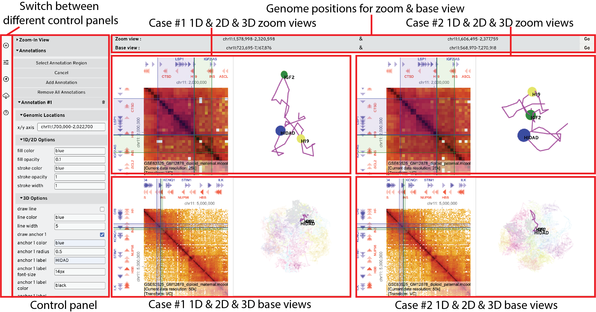

# How to Recreate the Figure



## Table of contents

- [1. Add datasets to API server](#1-add-datasets-to-api-server)
- [2. Add datasets to HiCube](#2-add-datasets-to-hicube)
- [3. Add zoom view](#3-add-zoom-view)
- [4. Configure track display options](#4-configure-track-display-options)
- [5. Add annotations](#5-add-annotations)
	- [5.1 Configure annotation display options](#51-configure-annotation-display-options)

## 1. Add datasets to API server

All datasets used to create the figure can be downloaded from [](https://doi.org/10.5281/zenodo.7601098)


- Gene annotation track: `gene-annotations-hg19.db`
- Maternal Hi-C track: `GSE63525_GM12878_diploid_maternal.mcool`
- Paternal Hi-C track: `GSE63525_GM12878_diploid_paternal.mcool`
- Chromosome labels: `hg19.chrom.sizes`
- 3D structure track: `GSM3271351_gm12878_05.impute3.round4.clean.g3d`

Move all the data files to folder `~/hg-data`, download and start docker container:

> `--volume ~/hg-data:/data` and `--volume ~/hg-tmp:/tmp` mount the local directories (path before `:`) to a path inside the container (path after `:`), make sure the path before `:` is an **absolute path** to the directory you store datasets, for example, if you store them at `~/Documents/hg-data`, then use `~/Documents/hg-data` before `:`

```bash
# Pull the latest image of higlass-docker
docker pull higlass/higlass-docker

# Start docker container
docker run --detach \
	--publish 8888:80 \
	--volume ~/hg-data:/data \
	--volume ~/hg-tmp:/tmp \
	--name higlass-container \
	higlass/higlass-docker

# Add chromosome size file to server
docker exec higlass-container python higlass-server/manage.py ingest_tileset --filename /data/hg19.chrom.sizes --filetype chromsizes-tsv --datatype chromsizes --coordSystem hg19 --name "Chromosomes (hg19)"

# Add gene annotation file to server
docker exec higlass-container python higlass-server/manage.py ingest_tileset --filename /data/gene-annotations-hg19.db --filetype beddb --datatype gene-annotation --coordSystem hg19 --name "Gene Annotations (hg19)"

# Add maternal cooler file to server
docker exec higlass-container python higlass-server/manage.py ingest_tileset --filename /data/GSE63525_GM12878_diploid_maternal.mcool --filetype cooler --datatype matrix --coordSystem hg19 --name "Rao et al. (2014) Diploid Maternal"

# Add paternal cooler file to server
docker exec higlass-container python higlass-server/manage.py ingest_tileset --filename /data/GSE63525_GM12878_diploid_paternal.mcool --filetype cooler --datatype matrix --coordSystem hg19 --name "Rao et al. (2014) Diploid Paternal"
```

If you're using the [build version](https://drive.google.com/file/d/1Z-k3tGMK0_rlbONuqD-OUT6Wybnhq__g/view?usp=sharing) of HiCube, inside the directory where you download and unzip `HiCube.zip`, run the following command to start the app:

**Option 1:** use [Node.js](https://nodejs.org/download/release/v16.15.0/) (v16.15.0 version):

```bash
# if serve is not installed
# if on macOS may need to use sudo
npm install -g serve
# change current directory to HiCube
cd HiCube
# start app
serve -s
```

**Option 2:** use python3:

```bash
# change current directory to HiCube
cd HiCube
# start app
python -m http.server
```

then open the printed link to HiCube.

## 2. Add datasets to HiCube

- Enter the local API server: http://localhost:8888/api/v1 (it could take a few seconds to initialize), click the **+** icon on the left side to add to **Track Source Servers**
- Choose `hg19` from the **Genome Assembly** selection list
- Click `Add A New Case`
- Under **Genome Positions** section, enter `chr11:723,695-7,167,876` for X axis, and `chr11:568,970-7,270,918` for Y axis
- Select `Rao et al. (2014) Diploid Maternal` from **Hi-C dataset** selection list
- Choose file `GSM3271351_gm12878_05.impute3.round4.clean.g3d` for **3D genome structure model** and select category to be `maternal`, resolution to be `1000000`
- Click `Add A New Dataset`
- Select data type to be `gene-annotation`, check `top` and `left` positions
- Click `Add A New Dataset`
- Select data type to be `chromsizes`, check `top` and `left` positions
- Click `Add A New Case` (the first case has been added)
- Click `Add A Paired Case`
- Choose `Rao et al. (2014) Diploid Paternal` as paired dataset for Hi-C track
- Choose file `GSM3271351_gm12878_05.impute3.round4.clean.g3d` for 3D genome structure model and select category to be `paternal`, resolution to be `1000000`
- Click `Add A Paired Case` (the second case has been added)

## 3. Add zoom view

- Click the **third button** on the sidebar
- Click `Select Zoom Region`, then press and hold down the left mouse button to select the region to zoom on the **center** Hi-C track
- Click `Create Zoom View` 
- Enter `chr11:1,578,998-2,320,598` on X axis and `chr11:1,606,495-2,377,759` on Y axis on the **Zoom Position** bar at the top, then click **Go**

## 4. Configure track display options

- Click the **second button** on the sidebar
- Click the `Rao et al. (2014) Diploid Maternal` track, it will show its display options
- Change `Zoom limit` to `25000`, and `Transforms` to `VC`, click `Update`

## 5. Add annotations

- Click the **third button** on the sidebar
- Add annotations via
	- Click **Select Annotation Region**, then press and hold down the left mouse button to select the region on the **top** or **left** 1D tracks, then click **Add Annotation**
	- **Or** copy the below annotation regions into **Enter genomic intervals** textarea, then click **Add Annotation**

```
chr11 1,700,000 chr11 2,022,700
chr11 2,022,700 chr11 2,179,621
```

### 5.1 Configure annotation display options

- Click on **Annotation #1**
	- Under **2D Options**, change **Fill Opacity** to 0.1, and **Stroke Width** to 1
	- Under **3D Options -> Line**, uncheck **Draw Line**
	- Under **3D Options -> Anchor 1**, check **Draw Anchor 1**, enter **Label** to be `HIDAD`
	- Click **Update**
- Click on **Annotation #2**
	- Under **2D Options**, change **Fill Opacity** to 0.1, and **Fill Color** to Green, **Stroke Width** to 1, **Stroke Color** to Green
	- Under **3D Options -> Line**, uncheck **Draw Line**
	- Under **3D Options -> Anchor 1**, check **Draw Anchor 1**, enter **Label** to be `H19`, change **Color** to be Orange
	- Under **3D Options -> Anchor 2**, check **Draw Anchor 2**, enter **Label** to be `IGF2`, change **Color** to be Green
	- Click **Update**
